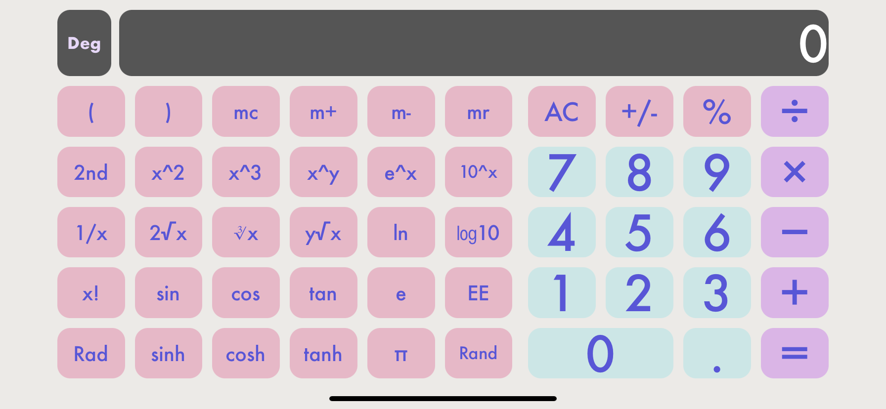
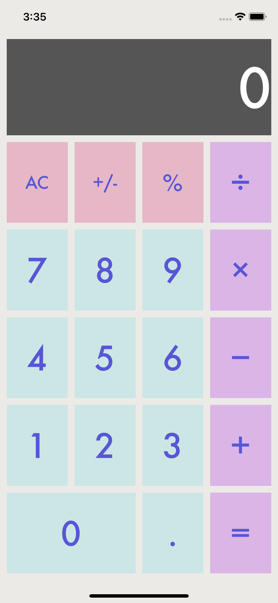
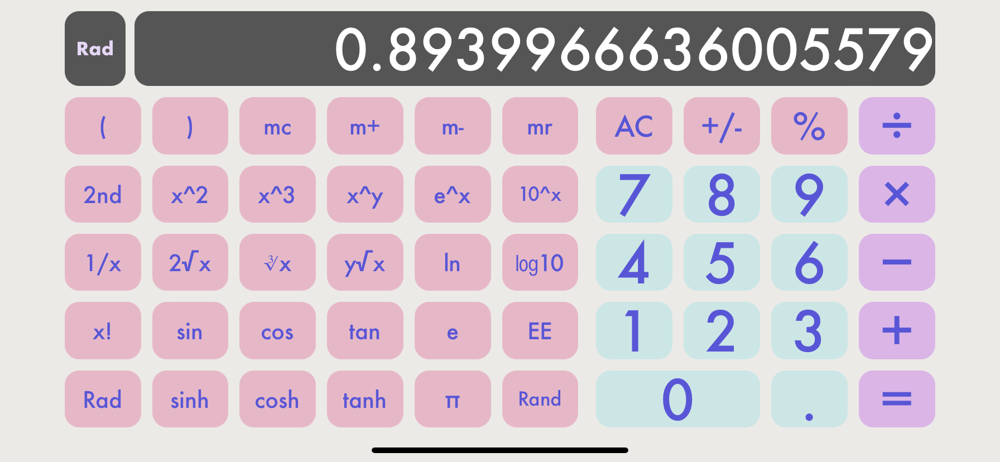

# iOS简易计算器实现

### 191220111 王凯文

### 1.测试环境：

- Xcode-13
- iphone-13pro/11 - simulator

### 2.运行界面

|  |  |
| ------------------ | ------------------ |

|  |
| ------------------ |
|  |

### 3.基本思路

​	主要是先按照老师的教程视频走一遍，踩一下可能的坑。

##### 3.1界面

​	用`storyboard`显示化地设计界面还是比较舒服的，界面布局利用`auto layout`可以很方便地适应不同尺寸的屏幕，`UI`是慢慢迭代的，在这个过程中对`auto layout`，`IB`等Swift相关技术的理解也慢慢深入。

​	横屏界面，可以为不同内容设置不同`size class`下是否`installed`来决定是否加载显示。

​	圆角设置，通过`runtime attribute`设置。如下是对比图，各有所好，不是说圆角就一定更好看。

​	启动界面，设置了一个简单的静态启动界面，有时启动较快启动界面停留时间较短。

|  |  |
| ------------------ | ------------------ |

##### 3.2计算

​	主要是像示例视频中那样创建一个`Calculator`类来单独处理计算功能，这在`OOP`中很常见，不同的模块处理不同的功能使得代码逻辑更为清晰。

老师示例中处理计算的方式很妙，我们可以用少量的代码完成各种操作。

大部分操作比较容易实现。

以下列出一些。

`x!`：模仿官方计算器，0结果为1，正负整数显示结果，非整数屏幕不显示，即无法运算。

`Rad/Deg`模式选择在横屏模式下添加一个`label`标签显示当下模式。如下：

|  |
| ------------------ |
|  |

`2nd`是改变一些`button`的`function`，首先在`view controller`设置按钮内容的变化，在加入对新功能的支持即可。`2nd`按下的变化如下(再次按下即在此切换成初始)：

|  |
| ------------------ |

如上图，如果一个操作溢出等，会显示`nan(Not A Number)`。

`1/0`这种结果则会显示`inf`。

`m+`，`m-`，`mr`，`mc`则是维护一个存储器即可。

### 4.难点，坑点及解决方案：

##### 4.1

横屏如何解决，一开始想尝试多个`View Controller`，但老师上课时提到计算器是典型的单个`View`的app，后面的开发才会使用到多个`View`。

`Auto layout`确实很方便，老师也提到了很多，绘制竖屏的`UI`很方便，但是怎么在横屏显示不一样的内容一开始确实比较`confusing`，好在翻了官方文档后并结合老师课件后，得到如下解决方案，设置内容在不同`size class`下是否`installed`即可。

##### 4.2

有一些操作可能直接在单目，双目操作内不太方便，于是在`enum Operation`针对一些情况分别设立了`case`，比如`rad/deg`模式，`M+`模式等，并结合类中其他自定义函数完成一些计算。

##### 4.3

按照老师的示例写计算功能。

遇到问题：启动计算器后，如果直接点`Rand`，`pi`等单目操作符会遇到问题报错

```swift
Thread 1: Fatal error: Unexpectedly found nil while unwrapping an Optional value
```

后与系统计算器对比，发现开始时屏幕上初始值为`0`，示例中设置为空，故一开始`digitondisplay`为`nil`报错，修改`viewDidLoad`后得到解决

```swift
- self.display.text! = ""
+ self.display.text! = "0"
```

##### 4.4

启动计算器后如果直接按某一个数字后，紧接着按=号，会报错崩溃，排查后，发现示例中=号处理不够全面，加入先前有无操作符（`+`，`-`等）按下的`bool`判断即可，且`2+3=`，`=`，`=`，这样的操作苹果计算器给出的答案是`5，8，11`，但结合其他计算器（卡西欧，其他手机等），修复为答案为`5，5，5`不变。

##### 4.5

`Rand`如果做`const`处理每次会返回同样的值，应做单目操作符处理。

##### 4.6

处理`sin`的时候对比标准计算器发现`swift sin`函数默认对应`rad`（弧度制），而不是计算器默认的`deg`（角度制），这一点尤其需要注意。同时处理`rad`，增加`rad`操作符和`radOn bool`变量处理，`rad`模式只对`sin`，`cos`等角/弧度操作做不同处理方案，考虑横屏模式下增加`rad`模式标识（显示为`Rad`或`Deg`）。


### 5.总结：

尽力而行，虽然不能像官方计算器那样尽善尽美，但在这个过程中也逐步体会到了`MVC`的精妙，以及`iOS`开发的乐趣和独特点。每一种语言都有其独到之处。